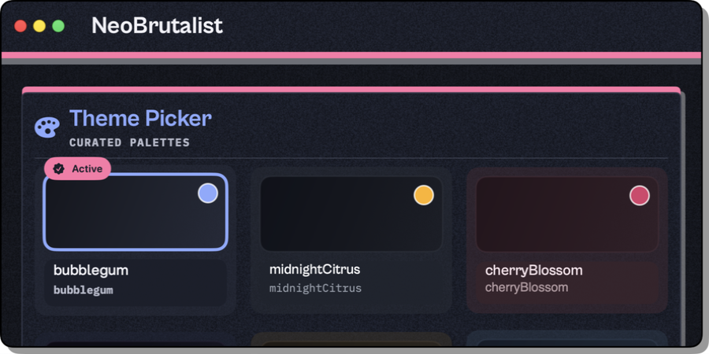
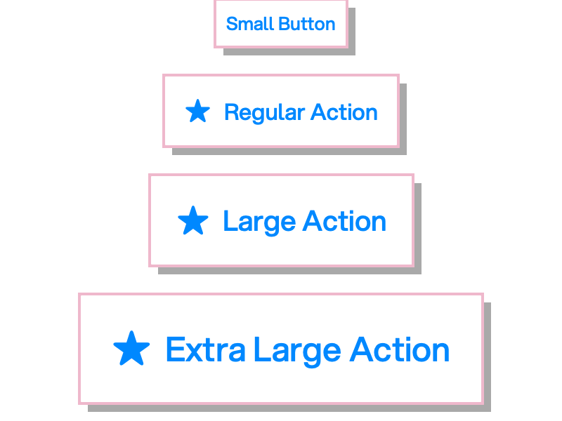

# NeoBrutaI

**Bold. Unapologetic. SwiftUI.**

A cross-platform component library that brings neo-brutalist design to macOS 15+.

Hard-edged shadows, high-contrast palettes, and geometric precision—wrapped in idiomatic SwiftUI with a powerful theming system.



## Quick Start

Add the package to your Xcode project or `Package.swift`:

```swift
dependencies: [
    .package(url: "https://github.com/GoodHatsLLC/NeoBrutal.git", from: "1.0.0")
]
```

Apply a theme and start building:

```swift
import SwiftUI
import NeoBrutal

struct ContentView: View {
    var body: some View {
        NeoBrutalCard(
          title: "Let's Go",
          icon: Image(systemName: "checkmark.circle.fill")
        ) {
          NeoBrutalButton {
						
          } label: {
            Label("Hit it.", systemImage: "bolt.fill")
              .labelStyle(.titleAndIcon)
          }
          .controlSize(.extraLarge)
        }
        .neoBrutalTheme(.bubblegum)
    }
}
```

That's it. No configuration files, no style inheritance chains, no override hierarchies.

## Component Previews



### Cards & Surfaces


## Features

- **Typography system** – Theme-controlled fonts with body and mono variants
- **Environment-based theming** – Themes propagate through the view hierarchy automatically
- **Light/dark mode support** – Themes adapt to system appearance changes

## Philosophy

Design systems don't have to whisper. NeoBrutalUI is for interfaces that **demand attention and make no apologies**. If you want subtle, this isn't it. If you want bold, geometric, and unapologetically loud—welcome home.
